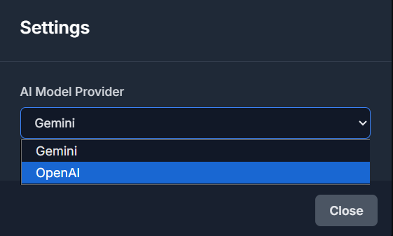

# カスタムAPI（Azure OpenAIなど）設定ガイド

このガイドでは、Intelligent Knowledge DistillerでOpenAI互換のカスタムAPI（例: Azure OpenAI Service）を設定する手順を、スクリーンショットを交えて説明します。

## ステップ1: プロジェクトの準備

まず、プロジェクトをローカル環境で実行できるように準備します。

1.  リポジトリをクローンし、プロジェクトのディレクトリに移動します。
2.  必要なライブラリをインストールします。
    ```bash
    npm install
    ```
3.  `.env.local`ファイルを作成し、APIキーを設定します。
    ```
    # .env.local
    OPENAI_API_KEY="YOUR_API_KEY"
    ```
    **注**: APIキーは、後述するアプリケーションのUI設定画面から直接入力することも可能です。

## ステップ2: アプリケーションの起動

以下のコマンドで、開発サーバーを起動します。フロントエンドサーバーと、API通信を中継するプロキシサーバーが同時に起動します。

```bash
npm run dev
```

ターミナルに以下のような表示が出たら、ブラウザで`http://localhost:5173`（ポート番号は異なる場合があります）にアクセスします。


## ステップ3: 設定画面を開く

アプリケーションがブラウザで表示されたら、画面右上にある歯車（⚙️）アイコンをクリックして、設定モーダルを開きます。


## ステップ4: AIプロバイダーの選択

設定モーダルが開いたら、「AI Model Provider」のドロップダウンメニューから`OPENAI`を選択します。



## ステップ5: カスタムAPI情報の設定

`OPENAI`を選択すると、詳細な設定項目が表示されます。

1.  **OpenAI API Key**:
    *   ステップ1で`.env.local`にキーを設定しなかった場合は、ここにAPIキーを入力します。ここで入力したキーが優先されます。

2.  **OpenAI API Base URL**:
    *   **最も重要な項目です。** お使いのカスタムAPIのエンドポイントURLを、**そのまま完全にコピー＆ペースト**してください。
    *   Azure OpenAI Serviceの場合、ポータルに表示される以下のようなURLをそのまま貼り付けます。
        ```
        https://your-resource-name.openai.azure.com/openai/deployments/YOUR_DEPLOYMENT_NAME/chat/completions?api-version=2024-02-01
        ```

3.  **OpenAI Model (Optional)**:
    *   Azure OpenAI Serviceを利用する場合、通常この欄は**空のまま**で問題ありません。デプロイ名は上記URLから自動的に抽出されます。


## ステップ6: 設定を閉じて実行

すべての情報を入力したら、「Close」ボタンで設定モーダルを閉じます。

これで、カスタムAPIを利用する準備が整いました。メイン画面の「Process」ボタンを押して、知識の抽出を開始してください。CORSエラーなどは、内蔵のプロキシサーバーによって自動的に回避されます。
